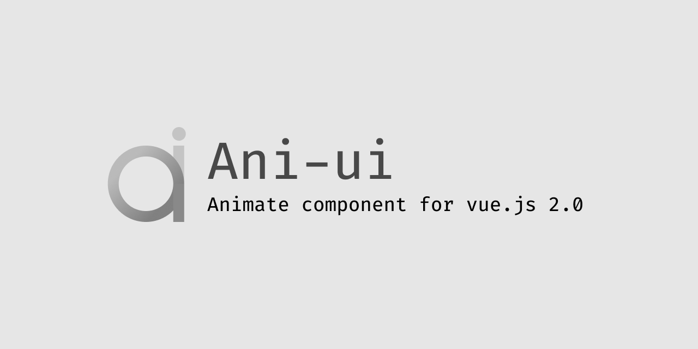

# ani-ui
Animate component for vue.js 2.0

### [中文 开始入手](./README_cn.md)
### [Documentation(Only Chinese temporarily)](https://laiiihz.github.io/ani-ui)

 




## Getting Started
### using  `yarn`
```shell script
yarn add ani-ui@latest
```

### using CDN
```html
<link rel="stylesheet" href="https://unpkg.com/ani-ui/dist/ani-ui.css">
<script src="https://unpkg.com/ani-ui/dist/ani-ui.common.js"/>
```

## using Material Design Icons
add this code to your `./public/index.html`
```html
<link href="https://fonts.googleapis.com/icon?family=Material+Icons" rel="stylesheet">
```
Using the icons in vue or html

exp. face icon
```html
<i class="material-icons">face</i>
```
## Build The Latest Version
### using `yarn` or `vue-cli-service`
```shell script
yarn output
```

```shell script
vue-cli-service build --target lib --name ani-ui ./src/lib/index.js
```
> those two commands are same command
> check it out in `$repo root dir`/dist 
## License
###  `MIT LICENSE`
view [License](./LICENSE) file

## Author
[laiiihz](https://github.com/laiiihz)

## Special Thanks
none
